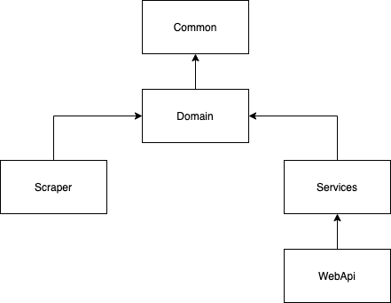

# RTL

RTL assignment where you need to scrape TVMaze, persist the data in a storage and make it public using a REST API.
 For more information about the assignment check: `assignment.pdf`

## Installation 
1. Build the NuGet packages
2. Make sure there is a Sql Server database available. I used a Docker container https://hub.docker.com/_/microsoft-mssql-server
3. Replace the connection string with your own credentials in the two json setting files `WebApi/appsettings.json` and `Scraper/appsettings.json`
5. Run the `Scraper` console project once for scraping TVMaze (I only scrape the top 250 shows). The `Scraper` project will let the `Domain` run the migrations for you.
6. Run the `WebApi` project
   

